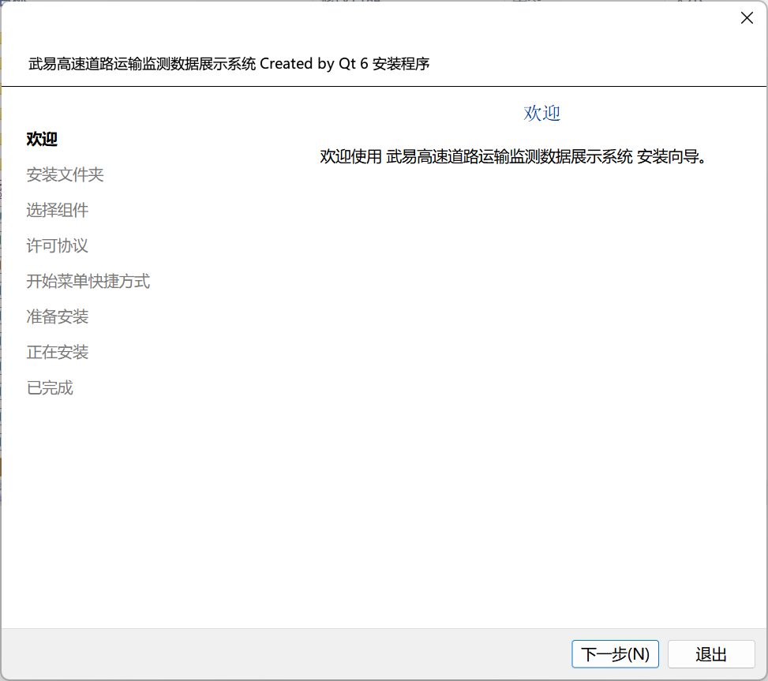
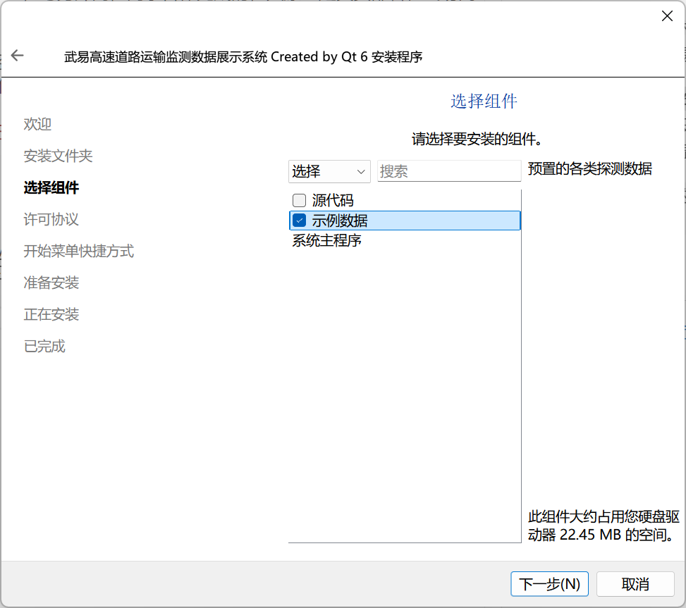

# 武易高速道路运输监测数据展示系统

## 简介

这是学校课程要求完成的一个项目 *（算是期末作业）* ，由我与另外两位同学合作完成，其原型是真实部署在武易高速上的系统。

项目使用 **`Qt 6.7.2`** 开源版开发，已经基本完成了课程的相关要求，并已通过了期末答辩。该程序并没有真正实现与检测装置的对接，而是基于教师提供的一些示例数据，对它们进行存储、显示与分析等。

> **注意：**
>
> - 项目中的图标全部来源于 [iconfont-阿里巴巴矢量图标库](https://www.iconfont.cn/)，图片全部来源于网络。
> - 本程序的数据量较多，限于技术原因，程序在读取和处理数据时需要消耗一些时间，这可能导致程序在进行某些操作时发生**卡顿**（甚至**无响应**）的情况，这也可能使得运行设备**发热**、**卡顿**，因而造成的**后果请自行承担！**

## 截图

### 登陆界面

### 主页面

### 人员管理界面

  

### 监测点管理页面

### 监测设备管理页面

### 监测数据查看、分析与展示页面

  
  

## 安装和维护

### 安装

我使用 `Qt Installer Framework (QIF)` 为程序制作了安装向导（如下图），用户可以方便地在 Windows 操作系统上安装、维护和卸载该程序。

访问 [Release 页面](https://github.com/Steel-Yao/HighWay/releases) 下载安装程序 `HighWay_installer.exe` ，并按照安装程序的引导安装即可。

> **注意：**
>
> - 默认管理员如下：
>   - 账号：123456
>   - 密码：123456
>
> - 为方便测试程序，在 **“选择组件”** 时，建议勾选 **示例数据** 部分（如下图，已默认勾选）。
>
>   

### 维护

安装完成后，如果要添加或移除组件，可以打开安装目录下的维护程序 `maintenancetool.exe`，并按照引导进行操作即可。

## 卸载

打开安装目录下的维护程序 `maintenancetool.exe`，选择 **“移除所有组件”** 并按照引导完成操作即可卸载。

## 数据文件说明

本系统将数据以文本文件（`*.txt`）和视频文件（`*.mp4`）的形式存储在计算机内，你可以在 [`data`](data) 文件夹下找到示例数据。

> **注意：**
>
> - 系统需要一个管理员账号才能正常登录和使用，且该账号不得删除。  
>   系统默认的管理员为：
>   - 账号：123456
>   - 密码：123456
> - 由于数据量较多，程序在读取和处理数据时需要消耗一些时间，这可能导致程序在进行某些操作时发生**卡顿**（甚至**无响应**）的情况，这也可能使得运行设备**发热**、**卡顿**，因而造成的**后果请自行承担**！

## 项目帮助

本项目使用 `Qt 6.7.2` 开源版开发，并使用 `QMake` 构建系统、`Qt 6.7.2 MinGW 64-bit` 编译套件构建和编译。在运行程序前，请将程序运行目录设置在项目的**根目录**，以便程序能够正确读取文件。
